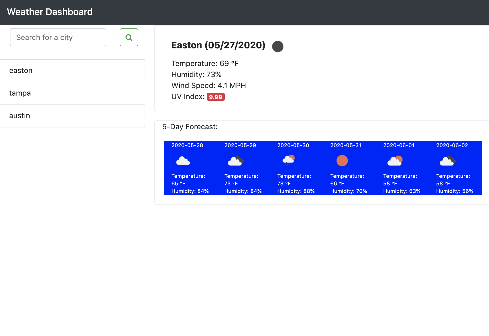

# WeatherDashboard

The weather dashboard can be found at this link. https://kwilks3.github.io/WeatherDashboard/

## Search Away

Search any city to find out the current and future weather. The color of the UV index represents whether conditions are favorable, moderate, or severe. Green represents a favorable UV index, yellow represents moderate, and red is severe.

You can also click on a city within the search history to repopulate its weather data.
